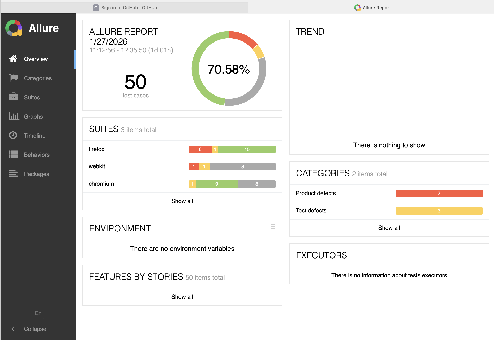
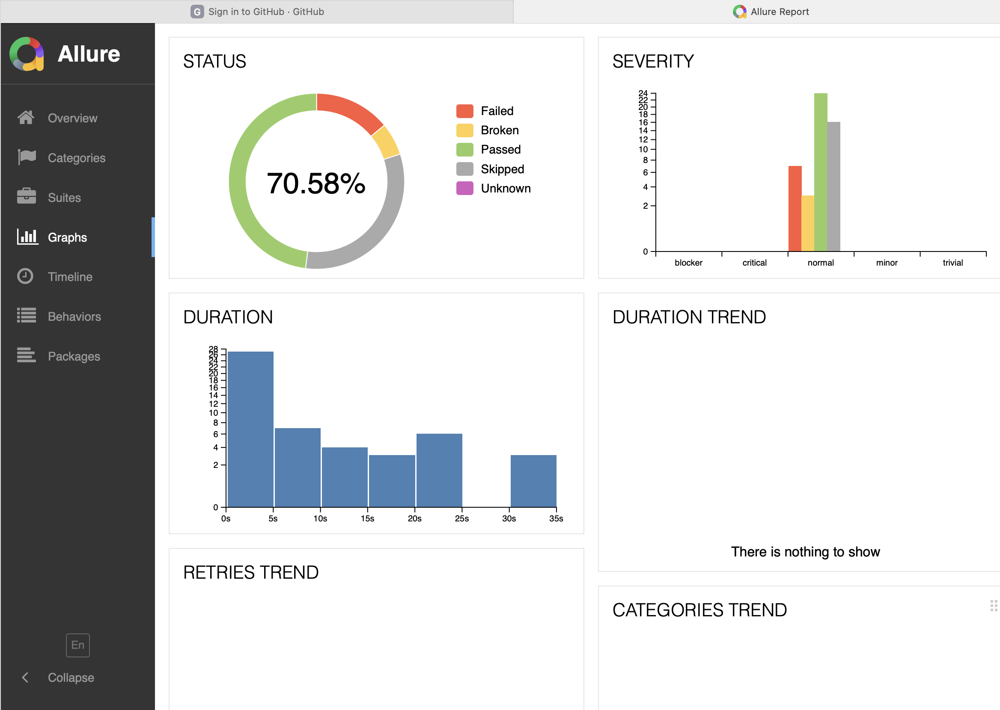

# 🎭 Playwright Automation Framework (TypeScript) – AutomationExercise

A complete industry-style End-to-End Automation Framework built using Playwright + TypeScript to automate UI + API workflows.

The framework includes advanced capabilities like AI-based failure analysis (local LLM powered), network mocking, visual regression testing, data-driven execution (Excel/JSON), and fully automated CI validation using Jenkins and GitHub Actions pipelines.

---

## ✅ Tech Stack

- Playwright Test Runner
- TypeScript
- Allure Reporting
- ExcelJS (Data Driven Testing)
- Ollama (Local LLM for AI Failure Analysis)
- Jenkins CI Pipeline
- GitHub Actions CI
- GitHub (Version Control)

---

## 📌 Automation Coverage

### ✅ UI Automation (`@UI`)
- Login
- Signup
- Product Search
- Review Product
- Place Order (E2E flow)
- Contact Us

### ✅ API Automation (`@API`)
- Products List API validation
- Search Product API
- Verify Login API (Playwright `APIRequestContext` + reusable API clients)

### ✅ Mock Testing (`@MOCK`)
- `route.fulfill()` → Mock response
- `route.continue()` → Modify request / redirect
- `route.abort()` → Simulate server down

### ✅ Visual Testing (`@VISUAL`)
- Home page snapshot baseline comparison
- Products page snapshot baseline comparison

### 🤖 AI Failure Analysis
- Automatically analyzes failed tests using local LLM (Ollama – Llama3)
- Generates root cause + fix suggestion
- Creates markdown report per failed test in `ai-reports/`
- Helps debugging without manually reading logs

---

## 🏗️ Framework Folder Structure

```bash
playwright-automation/
│
├── tests/
│   ├── ui/               # UI test cases
│   ├── api/              # API tests (APIRequestContext)
│   ├── mocks/            # Network interception tests
│   ├── visual/           # Visual regression tests
│   └── setup/            # storageState login setup
│
├── pages/                # Page Object Model classes
├── fixtures/             # Custom fixtures
├── utils/                # Helpers (Excel, API clients, generators)
├── test-data/            # JSON & Excel test data
│
├── ai/                   # AI integration (local LLM)
│   ├── ollamaClient.ts
│   └── failureAnalyzer.ts
│
├── reporters/
│   └── aiFailureReporter.ts   # Playwright custom reporter (AI analysis)
│
├── ai-reports/           # Generated AI failure analysis reports
├── assets/               # Screenshots used in README
│
├── .github/workflows/    # GitHub Actions CI pipeline
│   └── playwright.yml
│
├── playwright.config.ts
├── Jenkinsfile
├── package.json
└── README.md


## 🚀 How to Run Tests

### 🔧 Install dependencies
npm install
npx playwright install

### ▶️ Test Execution Commands
✅ Run Regression
npm run test:regression

✅ Run UI tests
npm run test:ui

✅ Run API tests
npm run test:api

✅ Run Mock tests
npm run test:mocks

✅ Run Visual tests
npm run test:visual

### 📊 Allure Report
Generate Report -
npm run allure:gen

Open Report - 
npm run allure:open

### 🧾 Allure Screenshots




### 🧠 Key Framework Highlights:
✅ Page Object Model (POM) architecture
✅ Data-Driven Testing using Excel + JSON
✅ Direct login using storageState session handling
✅ API automation using APIRequestContext
✅ Network mocking using fulfill / continue / abort
✅ Visual Regression baseline comparisons
✅ AI-based failure root cause analysis (local LLM)
✅ Jenkins parameterized pipeline execution
✅ GitHub Actions automatic commit/PR validation
✅ Parallel execution + retries + artifact reporting

### 🔁 CI/CD Integration

**Jenkins**
- Parameterized pipeline execution (UI/API/Regression)
- Allure report generation & artifact archiving

**GitHub Actions**
- Runs automatically on every push & pull request
- Installs environment and executes Playwright tests
- Uploads Playwright HTML report for debugging
- Prevents merging broken code


###🔗 Application Under Test (AUT)
UI: https://automationexercise.com/
APIs: https://automationexercise.com/api_list

###👤 Author
Akshay More
SDET | Playwright | API Automation | CI/CD (Jenkins)
```